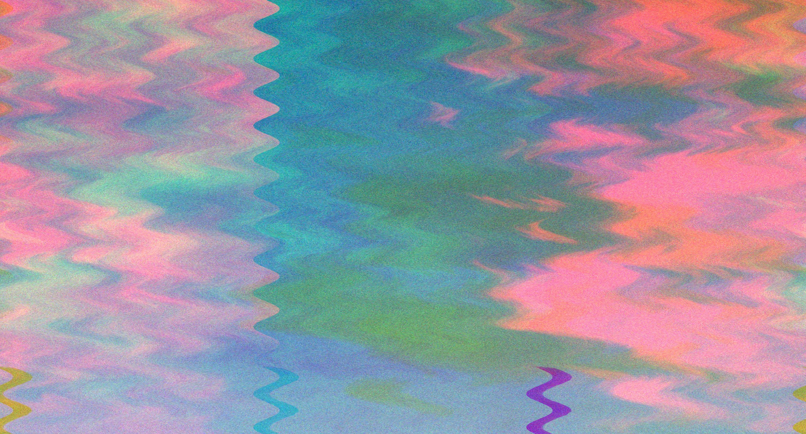

# Python Photo Manipulation Project

This Python project allows you to apply psychedelic effects to images using various techniques such as channel shifts, wave distortions, and generating unique output filenames.

## Example output



## Features

- Separate color channels and apply channel shifts to create psychedelic effects. The red and green channels are shifted by 250 pixels, and the blue channel is subtly shifted by 20 pixels to achieve a unique psychedelic effect.
- Utilize wave distortion with adjustable amplitude and frequency for a custom psychedelic wave effect. This effect has been fine-tuned to be more subtle, making the visual experience more pleasant.
- Generate unique output filenames for each processed image, ensuring that new effects do not overwrite previous ones.
- Option to apply a Gaussian blur is available but commented out by default. Users can easily enable this feature by uncommenting the relevant line.

## Requirements

- Python 3.x
- Pillow (Python Imaging Library, `pip install pillow`)
- NumPy (`pip install numpy`)

## Usage

1. Clone the repository or download the `bitcrush.py` script.

2. Ensure you have Python 3.x installed on your system.

3. Install the required dependencies using pip:

   ```bash
   pip install pillow numpy
   ```

4. Update the `image_path` and `output_dir` variables in the script to match your desired input image and output directory.

5. Run the script to apply the psychedelic effects to your image. The script will automatically save the processed image with a unique filename in the specified output directory.

## Sample Usage

To use the script, simply set the `image_path` and `output_dir` variables to your desired input and output locations, respectively. Here is an example:

```python
image_path = "/path/to/your/image.jpg"
output_dir = "/path/to/your/output/directory"

psychedelic_effect(image_path, output_dir)
```

## Contributors

- [Jason Gallagher](https://github.com/JsonGallagher)

## License

This project is licensed under the MIT License.
